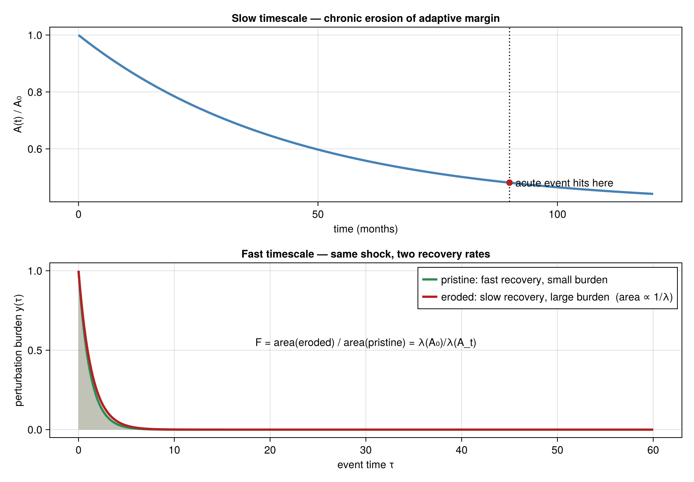

# TwoTimescaleResilience / burdenDK

A Julia framework for **background-conditioned vulnerability**: chronic
environmental pressure and retained chemical burden slowly narrow a species'
*adaptive margin*, which weakens its *restoring force*, which *amplifies* the
burden of a later acute perturbation. It models capacity erosion and
amplification rather than threshold exceedance, using a **capacity – pressure –
memory** architecture (AmP/DEB capacity · ECOTOX pressure · compound-retention
memory) with continuous, **threshold-free** outputs.



> *Slow chronic pressure erodes the adaptive margin (top); the same acute shock
> then produces a larger, longer burden when recovery is slower (bottom). The
> amplification factor is the ratio of the two response areas, `F = λ(A₀)/λ(A_t)`.*

## 📖 Documentation — start with the wiki

The full documentation lives in **[`docs/wiki/`](docs/wiki/Home.md)** (in-repo, so
it is versioned and reviewed with the code):

| | |
| --- | --- |
| **[Overview](docs/wiki/Overview.md)** | the idea — two timescales, capacity–pressure–memory, what it is / is not |
| **[How it works](docs/wiki/Pipeline.md)** | end-to-end pipeline, stage by stage |
| **[Model equations](docs/wiki/Equations.md)** | all the math in one place |
| **[Data & parameters](docs/wiki/Data-and-Parameters.md)** | AmP / ECOTOX / memory data + the offline mapping |
| **[Getting started](docs/wiki/Getting-Started.md)** | install, quickstart, demos, testing |
| **[Limitations & open questions](docs/wiki/Limitations-and-Open-Questions.md)** | honest status — read this before trusting outputs |

## Quick start

> **Julia 1.12.6 required.** The default LTS (1.10.x) cannot load this project.
> Use the `release` channel — see [Getting started](docs/wiki/Getting-Started.md).

```powershell
julia +release --project=. -e "using Pkg; Pkg.instantiate()"
```

```julia
using TwoTimescaleResilience

amp_lib = load_amp_species_library()
params  = amp_species_deb_params(amp_lib, "Daphnia magna")

ecotox_lib = load_ecotox_library()
records    = ecotox_filter_records(ecotox_lib; taxon_class = "Branchiopoda")

burden   = ecotox_records_to_deb_burden(Dict("7647-14-5" => 2.5), records)
response = ecotox_burden_to_response(burden, params)

println("Adaptive margin A_t : ", response.A)
println("Amplification  F_t  : ", response.amplification)
```

## The core chain

$$ C_{j,t} \;\rightarrow\; B_{j,t} \;\rightarrow\; x_{j,t} \;\rightarrow\; E_{\text{axis}} \;\rightarrow\; Q_t \;\rightarrow\; A_t \;\rightarrow\; \lambda(A_t) \;\rightarrow\; F_t $$

concentration → memory → active stress → per-axis impairment → scalar load →
adaptive margin → restoring force → amplification. Full detail in
[How it works](docs/wiki/Pipeline.md).

## Status

| Capability | Status |
| --- | --- |
| DEB-axis response math, AmP adapter, ECOTOX runtime, compound memory | implemented, tested |
| Mixture models (TU / IA / grouped CA-then-IA) | implemented, tested |
| Threshold-free spatial features → clustering → NetCDF | implemented, tested |
| Physiological condition memory `Z_t` | implemented, **opt-in, off by default** |
| Real-raster ingestion | partial (mostly examples) |
| DEBtox `D_t`, synergism/antagonism | not implemented (by design) |

> ⚠️ **Important caveat:** as currently parameterized the amplification factor is,
> numerically, a function of the DEB allocation fraction **κ alone** — an open
> scientific question, not a settled result. See
> [Limitations & open questions](docs/wiki/Limitations-and-Open-Questions.md).

## Not a full DEB model

This is a DEB-*informed*, physiologically-structured **vulnerability index**, not a
DEB / DEBkiss / DEBtox implementation: it borrows the process axes and parameters
but drops the dynamical reserve/structure/maturity/κ state equations. Mixtures are
combined by explicit assumptions, never fitted interaction coefficients.

## Contributing / maintaining

- Update the relevant [`docs/wiki/`](docs/wiki/Home.md) page in the same PR as any
  behaviour change; keep [Limitations](docs/wiki/Limitations-and-Open-Questions.md)
  current.
- Figures are regenerated by `examples/wiki_figures.jl` — edit the script, not the
  images.
- Project invariants (no arbitrary knobs, no thresholds in spatial features, keep
  `B_t`/`Z_t`/`D_t` distinct, mixtures-as-assumptions) are listed in
  [`CLAUDE.md`](CLAUDE.md) and [Getting started](docs/wiki/Getting-Started.md).
