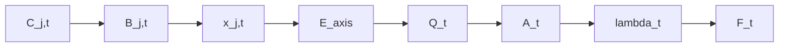

# TwoTimescaleResilience / burdenDK

## One-sentence summary

TwoTimescaleResilience is a Julia framework for modelling background-conditioned vulnerability: chronic environmental pressure and retained compound burden narrow species-specific adaptive margin, reduce restoring force, and amplify the burden of later acute perturbations.

## What problem does this solve?

Regulatory threshold maps are useful but insufficient: chronic, cumulative, persistent, mixture-mediated pressure can erode response capacity before discrete endpoint failure. This package models adaptive-margin depletion and amplification rather than only threshold exceedance, using capacity–pressure–memory language to describe vulnerability.

## Conceptual architecture

- **Capacity** = AmP/DEB-informed species response capacity
- **Pressure** = ECOTOX-derived stressor evidence and concentration fields
- **Memory** = retained internal burden $B_t$ through $\rho$ and $K$
- **Response** = $Q_t$, $A_t$, $\lambda(A_t)$, $F_t$
- **Optional spatial/regime workflow** = threshold-free features $\rightarrow$ standardisation $\rightarrow$ clustering $\rightarrow$ raster/NetCDF outputs

**Core chain:**
$C_{j,t} \rightarrow B_{j,t} \rightarrow x_{j,t} \rightarrow E_{\text{axis}} \rightarrow Q_t \rightarrow A_t \rightarrow \lambda_t \rightarrow F_t$

## What this package is

This package is a multi-scale resilience and toxicokinetic modelling framework. The following capabilities are implemented and tested within the core API:

- **DEB-axis response math:** Core impairment to response capability math (`src/deb_axes.jl`, `src/reduced_deb_response.jl`).
- **AmP species adapter:** Parses species parameters to instantiate physical response capacities (`src/amp_library.jl`).
- **ECOTOX parser and runtime:** Loads empirical data and routes active stress effects to DEB axes (`src/ecotox_library.jl`).
- **Compound memory:** Stateful updates for $B_t$ and analytical warm-up capabilities (`src/ecotox_library.jl`, `src/compound_memory_warmup.jl`).
- **Mixture-effect aggregation:** Aggregation of effects using TU, IA, or grouped CA-then-IA math (`src/mixture_aggregation.jl`).
- **Threshold-free feature vectors:** Construction and standardisation of geographic vulnerability features (`src/vulnerability_feature_vectors.jl`).
- **Clustering and Outputs:** Regime clustering and bundling to NetCDF outputs (`src/vulnerability_regime_clustering.jl`, `src/vulnerability_regime_outputs.jl`).

## What this package is not

- **Not a full DEB implementation**
- **Not DEBkiss**
- **Not full DEBtox**
- Does not currently implement DEB reserve, structure, maturity, kappa allocation, growth/reproduction ODEs, starvation, GUTS survival, or DEBtox scaled damage $D_t$.
- Does not implement synergism, antagonism, or arbitrary fitted interaction coefficients.
- Does not currently implement physiological condition memory $Z_t$.
- Does not yet provide stable real external raster ingestion (this is currently only handled in example scripts).

## Core equations

**Memory:**
$$ B_t = \rho B_{t-1} + (1-\rho) K C_t $$

**Stress:**
$$ x = \max\left(0, \frac{B \text{ or } C - \text{NOEC}}{\text{EC50} - \text{NOEC}}\right) $$

**$E_{\text{axis}}$ mixture models:**
- TU (Toxic Unit sum)
- IA (Independent Action)
- Grouped CA then IA

**Response capacity mapping:**
$$ Q_t = \sum_a w_a E_a $$

$$ A_t = A_0 \max(10^{-6}, 1 - Q_t) \quad \text{for EC50/precomputed impairment path} $$

**Restoring force and amplification:**
$$ \lambda(A) $$
$$ F_t = \frac{\lambda(A_0)}{\lambda(A_t)} $$

**Analytical warm-up:**
- Constant background
- Inverse target burden
- Periodic cycle

## Architecture graph

For an interactive map of how components compose, see [docs/ARCHITECTURE_GRAPH.md](docs/ARCHITECTURE_GRAPH.md).



## Main source files

- `src/TwoTimescaleResilience.jl`: Main module definition and exports.
- `src/amp_library.jl`: `load_amp_species_library`, `amp_species_deb_params`
- `src/ecotox_library.jl`: `load_ecotox_library`, `ecotox_records_to_deb_burden_stateful!`, `ecotox_active_stress`
- `src/compound_memory_warmup.jl`: `analytical_initial_burden`, `analytical_periodic_initial_burden`
- `src/deb_axes.jl`: Core DEB routing structures
- `src/reduced_deb_response.jl`: `compute_adaptive_margin_response`
- `src/mixture_aggregation.jl`: `aggregate_axis_mixture_effects`
- `src/vulnerability_feature_vectors.jl`: `build_threshold_free_vulnerability_features`, `standardize_threshold_free_vulnerability_features`
- `src/vulnerability_regime_clustering.jl`: `cluster_threshold_free_vulnerability_regimes`
- `src/vulnerability_regime_outputs.jl`: `write_vulnerability_regime_netcdf`

## Data files

- `data/AmP_Species_Library.json`: Source physiological parameters.
- `data/ECOTOX_Toxicity_Library.json`: Source parsed empirical toxicities.
- `data/Compound_Memory_Library.csv`: Source empirical retention ($\rho$) and bioaccumulation ($K$).
- `data/AmP_Species_Archetypes.csv` / `.json`: Derived cluster mappings of species behaviors.

## Examples

- **Quick:**
  - `examples/synthetic_raster_demo.jl`: Demonstrates basic spatial arrays.
  - `examples/ecotox_amp_multiaxis_response_calibrated_demo.jl`: Demonstrates simple ECOTOX and AmP lookup logic.
- **Medium:**
  - `examples/ecotox_amp_multispecies_multicompound_monthly_memory_demo.jl`: Demonstrates temporal updating of $B_t$ using multiple compounds.
- **Heavy / Extended:**
  - `examples/nc_monthly_longterm_isimip_moa_deb_inspection.jl`: Heavy loop producing spatial vulnerability outputs.
  - `examples/nc_real_raster_deb_axes_demo.jl`: Loads real NetCDF layers to produce response datasets.

## Tests

Because this framework interacts with heavy empirical databases, spatial mapping (`GeoMakie`), and file IO (`NCDatasets`), running the complete suite of tests can be extraordinarily slow during active development due to precompilation overhead.

The strategy is to execute **fast, core mathematical logic** tests by default, while gating visual/raster validations. For details, see [docs/TESTING_STRATEGY.md](docs/TESTING_STRATEGY.md).

## Quick start

```julia
using TwoTimescaleResilience

# 1. Load data
amp_lib = load_amp_species_library()
ecotox_lib = load_ecotox_library()

# 2. Extract specific AmP species parameters
params = amp_species_deb_params(amp_lib, "Daphnia magna")

# 3. Filter ECOTOX records to relevant taxa
records = ecotox_filter_records(ecotox_lib; taxon_class="Branchiopoda")

# 4. Compute stateless burden and response
concentrations = Dict("7647-14-5" => 2.5) # NaCl diagnostic concentration
burden = ecotox_records_to_deb_burden(concentrations, records)
response = ecotox_burden_to_response(burden, params)

println("Adaptive Margin: ", response.A)
println("Amplification Factor: ", response.amplification)

# 5. Stateful memory calculation
state = EcotoxExposureState()
stateful_burden = ecotox_records_to_deb_burden_stateful!(state, concentrations, records)
stateful_response = ecotox_burden_to_response(stateful_burden, params)

# 6. Optional: Threshold-free feature extraction
# Assumes arrays of Q_t and F_t exist
# features = build_threshold_free_vulnerability_features((Q_array, F_array))
```

## Development notes

- Prefer adding adapters, tests, and documentation rather than rewriting existing architectural core math.
- Keep chemical memory ($B_t$) strictly distinct from physiological condition memory ($Z_t$) and DEBtox scaled damage ($D_t$).
- Keep `grouped_ca_then_ia_axis_effects` as the preferred default when grouping mixture effects.
- **Strictly adhere** to threshold-free definitions. Do not include arbitrary exceedance features (`_gt_`, `threshold`).
- **Do not introduce** parameters named or behaving like `kappa`, `κ`, `gain`, `response_scale`, or `burden_to_margin_multiplier`.

*Audit Date: 2026-05-29*
