# Architecture Graph

## Audited date

2026-05-29

## Purpose

The architecture graph describes the package components as nodes and edges to show how data sources, adapters, core mathematical transformations, memory, mixture-effect aggregation, and geographic outputs fit together. It maps what is currently implemented, what is demonstrated in examples, and what remains explicitly unimplemented. It helps future AI assistants understand how different parts of the framework interact.

## How to read the graph

- **Implemented paths:** Solid lines and standard nodes represent tested, implemented capabilities in the source code.
- **Example-only / Partial:** Nodes or edges that rely mostly on `examples/` logic without a fully reusable core API.
- **Future / Not Implemented:** Dotted lines or explicitly marked nodes for logic (like physiological $Z_t$) that is planned or strictly excluded to maintain architectural stability.

## Mermaid overview graph

```mermaid
flowchart LR
    %% Data Sources
    AMPData[data/AmP_Species_Library.json] --> AMPLoader[load_amp_species_library]
    AMPLoader --> DEBParams[DEBAxisParams]

    ECOTOXData[data/ECOTOX_Toxicity_Library.json] --> ECOTOXLoader[load_ecotox_library]
    ECOTOXLoader --> ECOTOXRecords[ECOTOX records]

    MemoryData[data/Compound_Memory_Library.csv] --> MemoryLoader[load_compound_memory_library]

    %% Core Stateful / Stateless Path
    Concentration[C_j,t] --> BurdenUpdate[update_internal_burden!]
    MemoryLoader --> BurdenUpdate
    BurdenUpdate --> Burden[B_j,t]

    Burden --> ECOTOXStress[ecotox_active_stress]
    ECOTOXRecords --> ECOTOXStress

    ECOTOXStress --> Stress[x_j,t]

    %% Routing and Mixture Aggregation
    Stress --> DEBRouting[ecotox_effect_to_deb_axis]
    DEBRouting --> CompoundAxisBurdens[Compound Axis Burdens]

    CompoundAxisBurdens --> MixtureAgg[aggregate_axis_mixture_effects]
    MixtureAgg --> AxisEffects[E_axis]

    %% Reduced DEB Response
    AxisEffects --> Q[Q_t]
    DEBParams --> Q

    Q --> A[A_t]
    A --> Lambda[lambda A_t]
    Lambda --> F[F_t]

    %% Geographic / Regime Output Path
    F --> FeatureBuilder[build_threshold_free_vulnerability_features]
    FeatureBuilder --> Features[threshold-free features]
    Features --> Standardization[standardize_threshold_free_vulnerability_features]
    Standardization --> Standardized[standardized features]
    Standardized --> Clustering[cluster_threshold_free_vulnerability_regimes]
    Clustering --> Regimes[vulnerability regimes]
    Regimes --> Outputs[write_vulnerability_regime_netcdf]

    %% Future / Unimplemented
    PhysZ[Physiological Z_t] -.->|Future| A
    DEBtoxD[DEBtox Scaled Damage D_t] -.->|Not Implemented| Stress
    Synergism[Synergism/Antagonism] -.->|Not Implemented| MixtureAgg
```

## Node inventory

| node_id | label | type | source_or_path | public_api | status | notes |
|---------|-------|------|----------------|------------|--------|-------|
| `AMPData` | AmP_Species_Library.json | data_source | `data/AmP_Species_Library.json` | - | core_implemented | Source of physiological DEB capabilities |
| `AMPLoader` | load_amp_species_library | parser_or_loader | `src/amp_library.jl` | `load_amp_species_library`, `amp_species_deb_params` | core_implemented_tested | Adapts JSON into internal DEBAxisParams |
| `ECOTOXData` | ECOTOX_Toxicity_Library.json | data_source | `data/ECOTOX_Toxicity_Library.json` | - | core_implemented | Empirical toxicity dataset |
| `ECOTOXLoader` | load_ecotox_library | parser_or_loader | `src/ecotox_library.jl` | `load_ecotox_library`, `ecotox_filter_records` | core_implemented_tested | Reads records and routes effects |
| `MemoryData` | Compound_Memory_Library.csv | data_source | `data/Compound_Memory_Library.csv` | - | core_implemented | Retention/bioaccumulation factors |
| `MemoryLoader` | load_compound_memory_library | parser_or_loader | `src/ecotox_library.jl` | `load_compound_memory_library`, `compound_retention` | core_implemented_tested | Parses compound memory logic |
| `StatefulMemory` | EcotoxExposureState | stateful_memory | `src/ecotox_library.jl` | `EcotoxExposureState`, `update_internal_burden!` | core_implemented_tested | Chemical memory state $B_t$ |
| `CoreMath` | Reduced DEB Response | core_math | `src/reduced_deb_response.jl` | `compute_adaptive_margin_response` | core_implemented_tested | Calculates $A_t$, $\lambda_t$, $F_t$ |
| `MixtureMath` | aggregate_axis_mixture_effects | mixture_effect_model | `src/mixture_aggregation.jl` | `aggregate_axis_mixture_effects` | core_implemented_tested | TU, IA, grouped_CA_then_IA |
| `Features` | threshold-free features | feature_engineering | `src/vulnerability_feature_vectors.jl` | `build_threshold_free_vulnerability_features` | core_implemented_tested | Strictly avoids _gt_, threshold, etc. |
| `Standardization` | standardize features | preprocessing | `src/vulnerability_feature_vectors.jl` | `standardize_threshold_free_vulnerability_features` | core_implemented_tested | Standardizes arrays |
| `Clustering` | cluster regimes | clustering | `src/vulnerability_regime_clustering.jl` | `cluster_threshold_free_vulnerability_regimes` | core_implemented_tested | Discrete spatial vulnerabilities |
| `Outputs` | vulnerability outputs | output_io | `src/vulnerability_regime_outputs.jl` | `write_vulnerability_regime_netcdf` | core_implemented_tested | Writes regime clusters to NetCDF |
| `Z_t` | Physiological Z_t | future_or_not_implemented | - | - | planned | Z_t parameter exists but no math |
| `D_t` | DEBtox D_t | future_or_not_implemented | - | - | not_implemented | - |
| `RealRaster` | Stable Real Raster Pipeline | adapter | `src/netcdf.jl` | `load_nc_layer` | partial | Limited reusable real-raster API; mostly examples |

## Edge inventory

| from | to | relation | evidence | notes |
|------|----|----------|----------|-------|
| `data/AmP_Species_Library.json` | `load_amp_species_library` | consumes | `src/amp_library.jl` | - |
| `load_amp_species_library` | `DEBAxisParams` | produces | `src/amp_library.jl` | Instantiates capacity struct |
| `data/ECOTOX_Toxicity_Library.json` | `load_ecotox_library` | consumes | `src/ecotox_library.jl` | - |
| `data/Compound_Memory_Library.csv` | `compound_retention` | consumes | `src/ecotox_library.jl` | Lookups for $\rho$ and $K$ |
| $C_{j,t} + \rho + K$ | $B_{j,t}$ | updates | `update_internal_burden!` | Stateful compound memory step |
| $B_{j,t}$ | $x_{j,t}$ | computes stress | `ecotox_active_stress` | Scales by NOEC and EC50 |
| `effect_code` | `DEB axis routing` | routes | `ecotox_effect_to_deb_axis` | Maps to assimilation, maintenance, etc. |
| `compound axis burdens` | `mixture aggregation` | aggregates | `aggregate_axis_mixture_effects` | Applies TU or grouped IA |
| $E_{\text{axis}}$ | $Q_t$ | maps response | `compute_adaptive_margin_response` | Weighted sum of impairments |
| $Q_t$ | $A_t$ | maps response | `compute_adaptive_margin_response` | $A_t = A_0 \max(10^{-6}, 1 - Q_t)$ |
| $A_t$ | $\lambda(A_t)$ | maps response | `src/reduced_deb_response.jl` | Restoring force |
| $\lambda(A_0), \lambda(A_t)$ | $F_t$ | maps response | `src/reduced_deb_response.jl` | Amplification $F_t$ |
| $F_t, Q_t$ | `threshold-free features` | inputs to | `build_threshold_free_vulnerability_features` | Spatial aggregation |
| `feature vectors` | `standardisation` | transforms | `standardize_threshold_free_vulnerability_features` | - |
| `standardised features` | `clustering` | inputs to | `cluster_threshold_free_vulnerability_regimes` | - |
| `clusters` | `write NetCDF` | writes | `write_vulnerability_regime_netcdf` | - |

## Implemented workflow paths

1. **ECOTOX stateless response path:** Maps static background concentrations to ECOTOX records, routing the effect codes to DEB axes, scaling using mixture-effect assumptions, and outputting $A_t$ and $F_t$.
2. **ECOTOX stateful compound-memory response path:** Ingests temporal concentrations, updates `EcotoxExposureState` using compound-specific retention ($\rho$) and bioaccumulation ($K$), and computes trailing physiological responses.
3. **AmP species-capacity path:** Translates parsed JSON libraries of physiological profiles into parameterized `DEBAxisParams` limits for computation.
4. **Mixture-effect path:** Groups stressors using independent action (IA), toxic unit (TU), or grouped CA-then-IA math to combine axis impairments without assuming synergism.
5. **Threshold-free spatial regime path:** Aggregates grids of responses into normalized features without arbitrary binary limits (no exceeds, greater-thans) and clusters them into distinct geographic regimes.
6. **Output/NetCDF path:** Packages clusters and spatial vulnerability features into standard output bundles.

## Future or explicitly not implemented paths

- **Physiological condition memory $Z_t$:** Planned, parameter placeholders exist, but mathematical carryover is not currently implemented. Must wait until chemical memory and spatial features are completely stable.
- **DEBtox scaled damage $D_t$:** Explicitly not implemented to avoid confusing with basic internal burden $B_t$.
- **Synergism/Antagonism:** Excluded; the package focuses on mixture-effect assumptions, not curve-fitted interaction parameters.
- **Fitted interactions:** The codebase must avoid arbitrary mathematical tuning parameters (like `kappa`, `gain`, `response_scale`).
- **Stable real external raster ingestion:** Partially supported in `src/netcdf.jl`, but heavily reliant on example scripts rather than a fully robust reusable API.