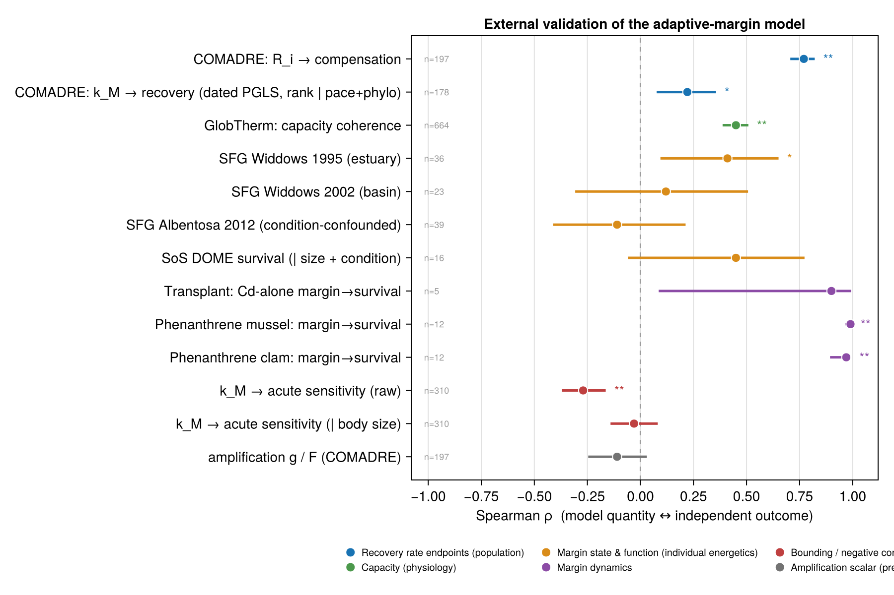
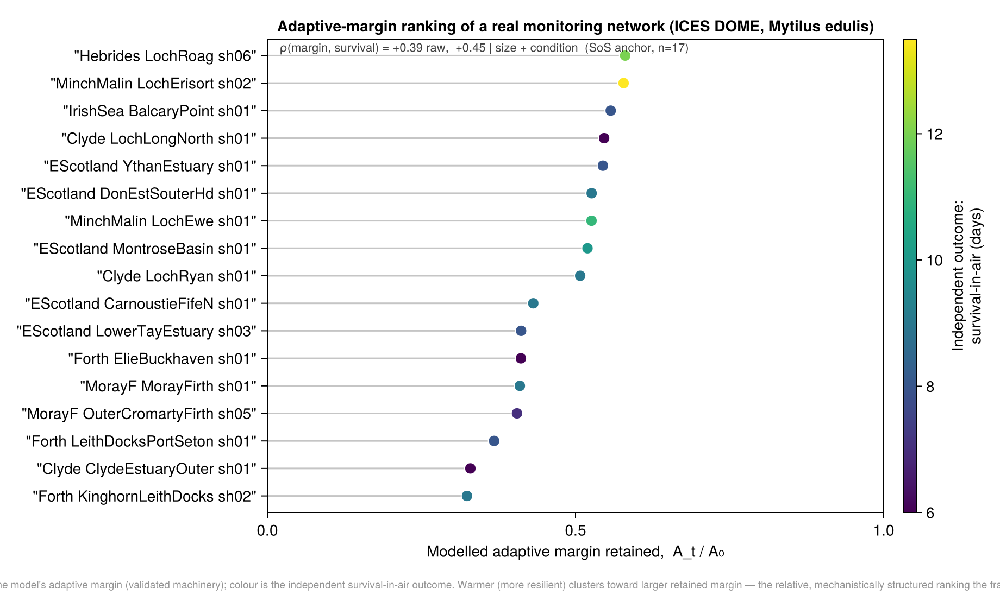

# External validation

Can the framework predict **independent** data it was never fitted to? This page consolidates
every external test of the model (the five anchors plus the bounding controls). The full,
manuscript-ready account with per-anchor detail is
[`docs/notes/external_validation_synthesis.md`](../notes/external_validation_synthesis.md); exact
commands and data provenance are in [Reproducibility](Reproducibility.md).

Three commitments keep the tests honest: **rank statistics** throughout (unit-invariant, robust to
the monotone-but-nonlinear responses the model produces), **pre-registered effect signs**, and
explicit reporting of nulls and bounds. The outcome is best read **margin-first**: external support
lands on the **adaptive-margin / recovery layer**, not on the one-dimensional amplification scalar.

## Scorecard

Effects are Spearman ρ; `*` p<0.05, `**` p<0.01.

| Anchor | Level | Result | Status |
| --- | --- | --- | --- |
| COMADRE (`k_M`, `R_i`) | population | `k_M`→recovery **+0.19–0.22\*** (rank; survives pace + a **dated-tree PGLS**, β\*=0.221, p=0.011; the log-linear form nulls); `R_i`→compensation **+0.77\*\*** | ✅ corroborated |
| GlobTherm (n=664) | physiology | capacity coherent (\|ρ\|≤0.45), **recovery-specific** (general resilience refuted) | ✅ bounding |
| Scope for Growth (×3) | energetics | **+0.41 → +0.12 → −0.11** (scale-dependent) | ✅ / ◐ |
| Stress-on-stress (DOME) | energetics | **+0.39 → +0.45** (confound-controlled) | ✅ static map |
| Viarengo 1995 | controlled dose | monotone dose-response; additive mixture | ✅ controlled |
| Transplant (Veldhuizen) | dynamics | continued erosion a static map can't; Cd-alone **+0.90** | ◑ proof-of-concept |
| Phenanthrene (Dellali), 2 spp. | dynamics, controlled | static flat vs dynamic erosion, 4 wk × 3 doses; ρ(erosion,LT50)=**−0.99/−0.97** (mussel/clam) | ◑ proof-of-concept |
| **`k_M`→toxicity (n=310)** | **cross-species** | **raw −0.27; nulls under body size (partial −0.03)** | ✅ bounding (negative) |
| Benzovindiflupyr 5-fish | cross-species, 1 chem | k_M→sensitivity −0.90 (n=5 pilot); axis weighting null; needs multi-MoA | ◐ pilot (capacity) |
| amplification `g`/`F` | — | **null everywhere** | ✅ (margin-first) |

## The anchors, briefly

**Recovery-rate endpoints — COMADRE (population demography).** The DEB maintenance rate `λ_min=k_M`
predicts the COMADRE log damping ratio (demographic recovery) beyond pace-of-life and coarse
phylogeny (raw +0.41\*\*, partial on generation time +0.26\*\*, within-Order +0.19\*). A **dated
TimeTree PGLS** (182 spp) settles the phylogeny question: Pagel's λ≈0 (phylogeny was never the
confound), and the `k_M`↔recovery signal **survives in rank form** under pace + dated covariance
(β\*=0.221, p=0.011) while the log-linear form nulls (p=0.96). The per-axis reproduction rate `R_i`
predicts demographic **compensation** (ρ=+0.77\*\*) — the strongest single result.

**Capacity coherence and its bound — GlobTherm.** The AmP capacity axis correlates with independent
thermal-tolerance data (|ρ|≤0.45), but higher `k_M/λ_max` implies *narrower* thermal breadth —
refuting a general-resilience reading. Recovery capacity is specific to demographic recovery, not a
universal resilience currency.

**The margin state — Scope for Growth.** At the margin's own organisational level (no scale bridge),
the modelled margin tracks measured SFG where tissue burden indexes exposure (+0.41 estuary), weakens
at basin scale (+0.12), and fails where condition/food dominates (−0.11). Metals behave as a
*positive* confound (see [Water-quality coupling](Water-Quality-Coupling.md)).

**The margin function — stress-on-stress (DOME).** Survival-in-air under emersion — the closest
*outcome* to the margin's purpose — tracks the modelled margin (+0.39→+0.45 under body-size and
condition control). Controlling the confound here *strengthens* the signal — genuine margin erosion,
not a health-proxy artifact. A controlled-exposure cross-check (Viarengo 1995) gives a monotone
dose-response and an additive binary mixture, bracketed by the model's own CA/IA rules.

**The margin dynamics — two proof-of-concept tests.** *(1) Transplant (Veldhuizen):* cadmium burden
plateaus by 2.5 months yet survival keeps dropping to 5 months — continued erosion a static map cannot
produce, reproduced on the model's *unfitted* months-scale `1/λ`; cadmium alone tracks survival ρ=+0.90
(n=4). *(2) Phenanthrene (Dellali 2023), cleaner, controlled, 2 species:* *M. galloprovincialis* **and**
*R. decussatus* at constant waterborne phenanthrene, survival-in-air over 4 weeks × 3 doses with a flat
control. Constant exposure ⇒ a static map predicts no temporal change, yet LT₅₀ falls progressively and
dose-dependently in both (mussel 5/42/57%, clam 10/50/50% over 7→28 d); the dynamic erosion rises
(1/λ ≫ 28 d) with dose-ordered magnitude. Each species is an independent 12-cell grid: ρ(erosion, LT₅₀)=
**−0.99** (mussel), **−0.97** (clam), with genuine dose×time inversions (no longer monotone-by-construction).
The clam is more anoxia-tolerant at baseline (~13 vs ~9 d) — anoxia physiology, not the contaminant margin;
control-normalised pooling gives **−0.91** (n=24), and the absolute gap is the open capacity-weighting
question. Single PAH → assimilation axis, no metal/PCB confound. *(Script:
`examples/sos_dynamic_validation_dellali.jl`.)*

**Bounding negative controls — single-trait `k_M`→toxicity is size-confounded.** Acute LC50/EC50 for
four AChE inhibitors (ECOTOX, n=310) replicate the raw maintenance→sensitivity link (ρ≈−0.27) but it
**nulls under a body-size control** (partial ≈−0.03). The model's distinctive leverage is therefore
its **across-axis capacity weighting**, *not* `k_M` as a scalar predictor.

## The licensed use, and does the structure earn its keep?

The framework's defensible use is **relative**: mechanistically-structured rankings of sites, months, or
scenarios under sustained pressure — not absolute prediction. The **bridge figure** shows this on
validated ground: the 17-station ICES DOME network **ranked by modelled adaptive margin** `A_t/A0`,
coloured by the independent survival-in-air outcome (warmer = more resilient clusters toward larger
retained margin; ρ=+0.39 raw, +0.45 controlling size+condition). It uses **only validated stress-on-
stress machinery** and introduces **no modelled water concentration** — the point where a water-quality
monitoring product and an ecological response model meet, with nothing claimed about the spatial
coupling. *(Script: `examples/dome_margin_ranking_figure.jl`.)*

A within-anchor **ablation** asks whether the routed, capacity-structured margin beats a *naive
equal-weight load* index (no routing, no structure). It does, at every field anchor:

| anchor (outcome) | naive load | routed margin |
| --- | --- | --- |
| Widdows 1995 estuary (SFG) | +0.22 | **+0.41\*** |
| Widdows 2002 basin (SFG) | +0.005 | **+0.12** |
| Stress-on-stress, DOME (survival-in-air) | +0.32 | **+0.39** (+0.45 \| size+cond.) |

This supports the **operative response structure** (MoA routing, bounded impairment, axis aggregation) —
*not* the across-species capacity **weighting**, which is held constant within each single-species anchor
and remains the open question below.

**Ranking robust to the response curve.** Since the licensed use is a *relative ranking*, we
sensitivity-test it against the impairment-curve form (not just the MoA routing). Swapping `E=x/(1+x)`
for Hill (`h=0.5,2`) or `1−e^−x` — all threshold-free and half-saturating at the reference, so no knob
is reintroduced — barely moves the corroboration (margin↔outcome ρ within ±0.03) and leaves the site
ranking near-identical (rank ρ ≥ 0.99). The relative ranking does not depend on the specific impairment
form. *(Script: `examples/response_curve_sensitivity.jl`.)*

## Honest through-line

- **Rank-robust, magnitude-modest, specification-sensitive.** Effects are ρ≈0.2–0.45 (corroboration,
  not strong prediction); the headline `k_M` result survives a dated-tree PGLS in rank form but nulls
  log-linearly. Report them as monotone tendencies.
- **The amplification scalar `g`/`F` is null everywhere** — exactly the margin-first prediction.
- **The distinctive content — the across-axis capacity weighting — remains untested.** Every
  individual-level test is single-species (capacity held constant), and the one cross-species
  single-trait link is size-confounded. It is carried as a model assumption.

See [Limitations & open questions](Limitations-and-Open-Questions.md) for what this does and does not
license.
