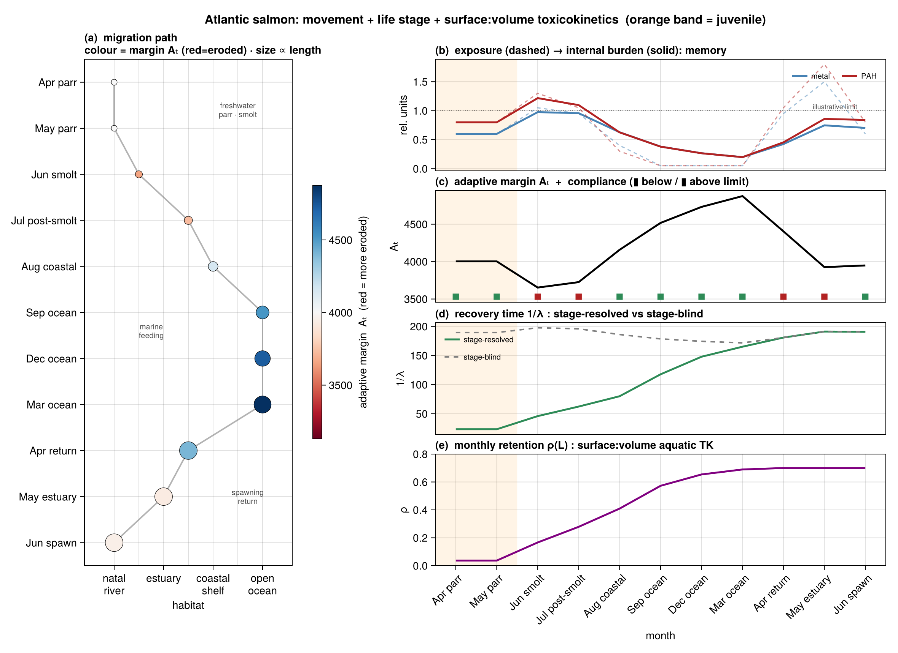
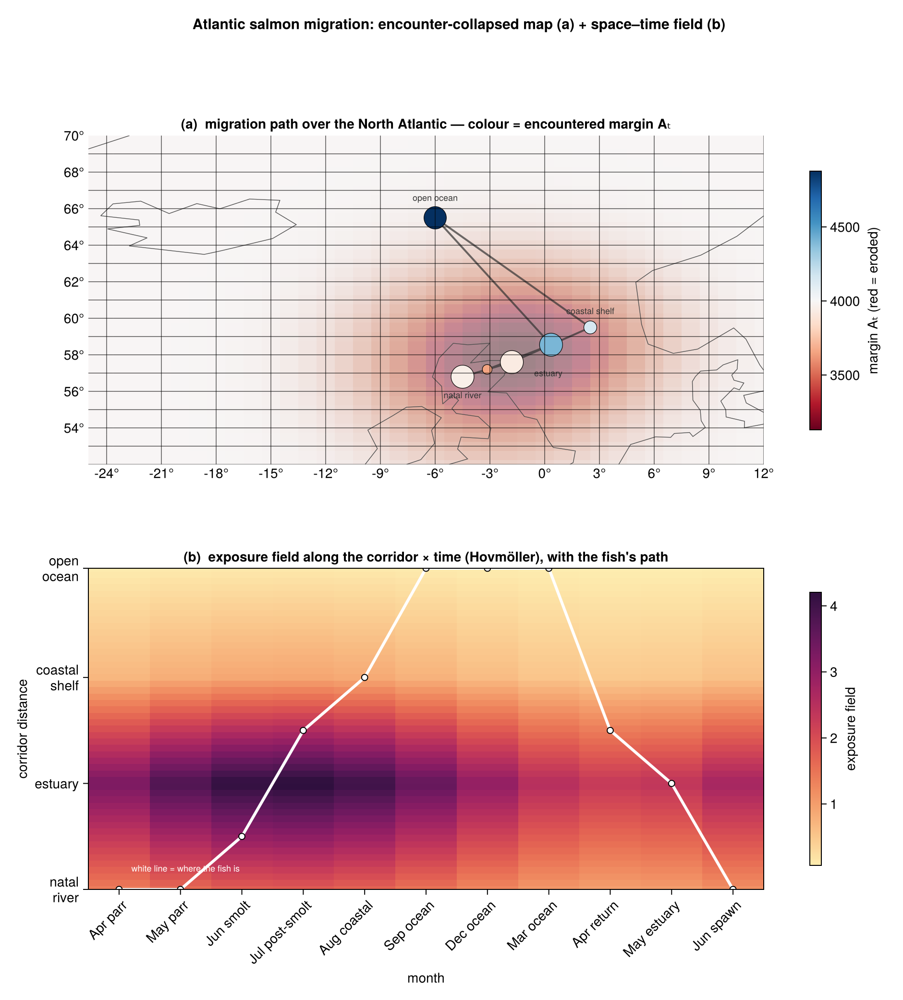

# Life stages & movement

The modelling unit `q` can be a **life stage**, and the target can **move**. Both are recent,
**strictly additive** extensions of the capacity–pressure–memory core: they reuse the existing
margin, recovery, and compound-memory machinery and change nothing in the validated whole-organism
path. Both are **implemented but not yet externally validated** — the validation is still adult,
sessile *Mytilus edulis* (see [External validation](External-Validation.md)).

## Stage-resolved capacity

Dynamic Energy Budget theory is ontogenetic, so a juvenile and an adult of the same species share
the same *primary* parameters but are distinct targets. We evaluate existing DEB expressions at the
stage's structural length `L` — **no new knobs**:

- **Recovery is length-dependent.** The restoring-force ceiling is `λ_max = v_eff(L)/L` (energy
  conductance over *current* length), so a smaller stage recovers faster. `λ_min = k_M` and
  `A₀ = E_m` (a reserve **density**) stay stage-invariant — so the stage effect lives in the
  recovery *rate*, not in the static margin.
- **Metabolic acceleration** (abj/ssj models, common in fish) enters as `v_eff(L) = v·s(L)`,
  piecewise across the `L_b → L_j` window, plateauing at `v·s_M` after metamorphosis.
- **The (1−κ) axis** keeps its weight and is *relabelled* maturation (before puberty) →
  reproduction (after); the DEB allocation fraction is continuous across stages, so the weight does
  not change.

Capacity comes from an additive `ontogeny` block in the AmP library (`L_b, L_j, L_p, L_i, s_M, …`).
Opt-in API (the whole-organism path is unchanged):

```julia
deb_params_at_length(record, L)          # continuous: a DEBStageProfile at structural length L
deb_params_for_stage(record, :juvenile)  # discrete wrapper (:juvenile / :adult)
```

Because `L_i = s_M·L_m`, the `:adult`-at-`L_i` profile reproduces the whole-organism `λ_max`
exactly, so existing behaviour is preserved.

> **Why A₀ stays constant:** `A₀ = E_m` is a reserve *density*, so the margin is *relative*
> (`A_t = A₀(1−Q)`, `Q∈[0,1]`). Making it an *absolute* capacity (∝L³) would break the
> threshold-free design. The DEB-correct lever for "small early stages are extra vulnerable" is the
> **exposure side** (surface:volume, below), not `A₀`.

## Movement / mobile targets

The resident model exposes a target to the field at a single cell. A mobile animal experiences the
**residence-time-weighted field along its trajectory**. The compound-memory recurrence
`B_t = ρ·B_{t-1} + (1−ρ)·K·C_t` is already a temporal integrator, so movement only replaces the
single-cell `C_t` with an **occupancy-weighted** one:

```julia
occupancy_weighted_exposure(region_concs, occupancy)   # C = Σ_g π_g C_g
```

A single occupied region reduces exactly to the resident case. The slow state `B_t` then carries
burden *between* regions — a migrant can arrive somewhere "clean" still eroded from an earlier leg.

## Surface:volume aquatic toxicokinetics

For **waterborne** uptake (gill/skin), the contaminant exchanges across the body *surface* and
dilutes into *volume*, so the exchange rate scales ∝ 1/L. Both uptake and elimination scale, so
steady-state burden is size-independent and only the **rate** moves with length — implemented as a
length-dependent monthly retention `ρ(L) = ρ_ref^(L_ref/L)`: a small juvenile equilibrates fast
(tracks the ambient water), a large adult lags (carries burden longer).

```julia
waterborne_stage_retention(ρ_ref, L, L_ref; waterborne)   # gated: ρ_ref unchanged if not waterborne
```

It is **gated to the waterborne route** — inert for terrestrial, air-breathing, or
dietary-dominated targets.

## Worked example — Atlantic salmon

`examples/salmon_migration_demo.jl` (table) and the two publication figures put it together for an
anadromous *Salmo salar* on a stylized path through a synthetic per-region regime (shared scenario
`examples/salmon_migration_scenario.jl`).



The trajectory figure shows memory carrying burden between regions, the parr recovering ~9× faster
than the returning adult, and the surface:volume `ρ(L)` climb — plus the exceedance-vs-vulnerability
contrast (compliant at spawning yet eroded).



The map (GeoMakie, real coastline) collapses time onto the path, colouring it by the margin the fish
*encounters*; the Hovmöller companion un-collapses it, showing the field over corridor distance ×
time with the fish threading through.

```powershell
julia +release --project=. examples/salmon_migration_demo.jl      # table
julia +release --project=. examples/salmon_migration_figure.jl    # trajectory figure
julia +release --project=. examples/salmon_migration_map.jl       # map + Hovmöller (needs GeoMakie)
```

## Status

Implemented and unit-tested (additive; the fast suite stays green). **Not yet externally
validated** — stage-resolved capacity and movement both await purpose-built data (stage- and
movement-resolved contaminant–outcome series). They are model capabilities, not validated claims.
