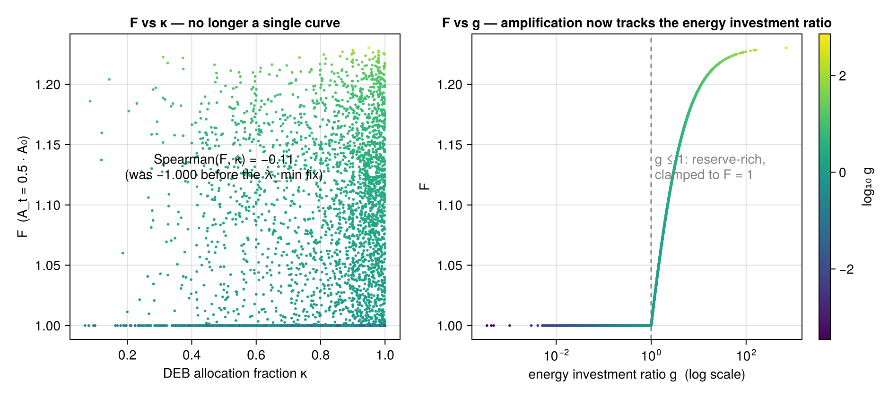

# Limitations & open questions

[← Getting started](Getting-Started.md) · [Home](Home.md)

This page is deliberately blunt. It protects the model's credibility by keeping
the weak points visible. Keep it current in the same PR as any change that affects
it. Evidence: [source audit (2026-06-11)](../claude/TwoTimescaleResilience_source_audit_2026-06-11.md)
and the read-only diagnostics in `examples/`.

## 1. The headline finding — amplification is a one-dimensional index

`F = λ(A₀)/λ(A_t)` is, by construction, a *ratio of one curve that depends only on the
relative margin* `A/A₀`. Because the margin erodes proportionally (`A_t = A₀(1−Q)`),
the species scale `A₀` cancels, so **F reduces to a one-parameter family per species**
— it cannot simultaneously carry capacity (`A₀`), allocation (κ), *and* economy. The
question has always been *which* one parameter, and whether it is meaningful. (Full
derivation: [the tex note](../notes/lambda_min_maintenance_rate.tex).) With the recovery
curve now **linear** (the `KA` half-saturation knob removed, see §2), `F_max = λ_max/λ_min
= g` exactly at full erosion.

**Originally that parameter was the bare allocation fraction κ.** Across the whole
library `Spearman(F, κ) = −1.000` to machine epsilon; `A₀` (six orders of magnitude)
and three of the four α-axes contributed nothing. Cause: the slow floor was
`λ_min = [p_M]/[E_m]` (maintenance over *reserve density*), which forced
`λ_max/λ_min ≡ 1/κ`. A structural comparison
(`examples/amp_lambda_structure_comparison.jl`) showed the lock lived in the
**λ-bounds**, not in `KA`.

**This has been addressed** by re-anchoring the floor to the textbook DEB somatic
maintenance rate constant `λ_min = min(k_M, λ_max)`, `k_M = [p_M]/[E_G]`. The
timescale ratio then becomes the **energy investment ratio** `g = (v/L_m)/k_M` — a
primary DEB parameter — and F now tracks `g`, not κ:



| | before fix | after fix |
| --- | --- | --- |
| Spearman(F, κ) | −1.000 | −0.107 |
| Spearman(F, g) | — | +0.725 |
| Spearman(g, κ) | — | −0.244 |

Vulnerability now partitions species as *reserve-rich (`g ≤ 1`) → resilient (`F = 1`)*
and *reserve-poor (`g > 1`) → amplification graded by `g`*. (Status: on branch
`fix/lambda-min-maintenance-rate`; validate with `examples/amp_lambda_min_validation.jl`.)

### The remaining open questions (now sharper)

1. **One-dimensionality is structural.** F-as-a-ratio can express only one
   physiological number per species. If capacity, allocation *and* economy should all
   matter, the single-ratio F is the wrong vehicle — that needs a richer response
   model, not another re-anchoring. **This is why the framework treats the
   adaptive-margin state — relative depletion `Q_t`, the capacity-aware absolute
   margin, and the axis composition — as the primary output, and `F` as a derived
   readout** ([Overview](Overview.md), [Pipeline §5](Pipeline.md)).
2. **The range of `g`.** `g` spans ~`10⁻³`–`10²`, so a large fraction of species clamp
   to `F = 1` and the `Q→1` ceiling now equals `g` exactly (`F_max = g`, since the curve
   is linear), reaching ~`10²` for extreme `g` (at `Q = 0.5` it stays tame). Mapping the
   rate ratio to `g` *raw* is likely too literal; how to tame
   it — and whether the `g = 1` clamp is a real biological boundary — is open. **Do
   not add a compressing transform without justification** — that would re-introduce
   exactly the kind of free knob this whole effort removed.
3. **Is `g`-driven vulnerability correct?** "Reserve-poor, structure-expensive species
   amplify more" is testable but **unvalidated**. This needs an external anchor and DEB
   expert review, not more internal tuning.

## 2. The `KA = 0.3·A0` constant — REMOVED (2026-06-12)

The `0.3` had **no derivation** and violated the project's no-knob invariant. It has
now been **removed**: the recovery curve is **linear** in the relative margin,

```
λ(A) = λ_min + (λ_max − λ_min) · clamp(A/A0, 0, 1)
```

so the pristine margin gives `λ_max` exactly (the old Michaelis–Menten form never
reached `λ_max` at finite margin), a fully eroded margin gives `λ_min`, and
`F_max = λ_max/λ_min = g`. There is no longer a half-saturation constant. Legacy JSON
records may still carry a vestigial `KA` field; it is ignored by `amp_library.jl`, and
`AmP_Translator.jl` no longer writes it. This was the last no-knob-invariant violation
in the λ-curve.

## 3. What was fixed (and what those fixes did *not* fix)

Four real defects have been addressed:

- **`λ_min` mis-normalization (the κ-collapse, §1).** `λ_min = [p_M]/[E_m]` →
  `λ_min = min(k_M, λ_max)` with `k_M = [p_M]/[E_G]`. Amplification now tracks the
  energy investment ratio `g` instead of the allocation fraction κ.
- **`KA = 0.3·A0` knob removed (§2).** The recovery curve is now linear in the
  relative margin; the last unjustified λ-curve constant is gone (no-knob invariant).
- **Margin inertness (D1).** The default response mode is now the nondimensional
  `ec50_anchored_fractional_impairment` (`A_t = A0·(1−Q_t)`). The old
  `raw_margin_subtraction` (`A_t = A0 − Σ α·s`, inert because `A0 ≫ Σ α·s`) is
  retained as a diagnostic only.
- **Dead assimilation axis (D2).** The default weights are now κ-rule,
  assimilation-led. The previous normalized-α weights gave assimilation a weight
  of ~0.00004 for **every** species; it is now 0.5.

**What these did *not* fix:** F is still a *one-dimensional* index (§1) — the `λ_min`
fix changed *which* parameter (κ → g), not the dimensionality. And the **grid /
ECOTOX / ISIMIP** pipelines are still on the raw subtractive margin, so the spatial
vulnerability *maps* can still be inert — a known follow-up.

## 4. Scope boundaries (by design, not bugs)

- **Not full DEB/DEBtox.** Reserve/structure/maturity/κ-allocation dynamics are
  dropped; "mechanistic" overclaims, "physiologically structured" is honest.
- **`Z_t` (physiological condition memory)** is implemented but **opt-in and off by
  default** (`beta_Z=0`), and not yet validated/calibrated
  ([`condition_buffer.jl`](../../src/condition_buffer.jl)). Earlier docs that call
  it "not implemented" are stale.
- **`D_t` (DEBtox scaled damage)**, synergism, antagonism, fitted interactions:
  not implemented, intentionally.
- **Real-raster ingestion** is partial — basic NetCDF utilities exist
  ([`netcdf.jl`](../../src/netcdf.jl)) but robust general ingestion is mostly
  example scripts, not a stable API.
- **Life stages & movement** are implemented (stage-resolved capacity, occupancy-weighted
  exposure, surface:volume `ρ(L)`) but **not yet externally validated** — the validation is still
  adult, sessile *M. edulis*. They are capabilities, not validated claims. See
  [Life stages & movement](Life-Stages-and-Movement.md).

## 5. Proxies carrying weight on thin evidence

- `ρ`, `K` are class-level memory defaults, not measured kinetics.
- **Stressor→DEB-axis routing is a declared pMoA assumption, not a fit.** For aggregate
  water-quality stressors the routing lives in `data/pMoA_Stressor_Routing.csv` (physiological
  mode-of-action; fitted DEBtox pMoAs where available, mechanism otherwise) — *not* tuning weights.
  The tempting in-house shortcut (read pMoA off ECOTOX `effect_code` sensitivities) was prototyped and
  is a **documented negative**: the DEB κ-cascade makes reproduction the most-sensitive endpoint for
  almost any pMoA, so endpoint ≠ pMoA. The `heavy_metals` field-vs-fitted dual route is empirically
  settled (metals→assimilation degrades all field anchors). See
  [Water-quality coupling](Water-Quality-Coupling.md).
- **The capacity weighting — the distinctive content — is untested**, carried as a model assumption
  (like the mixture rules) pending across-species gradient data that largely does not exist. And the
  single-trait `k_M`→toxicity reduction is **body-size-confounded** (well-powered null, n=310) — the
  leverage is the *across-axis weighting*, not `k_M` alone ([External validation](External-Validation.md)).
- These are honestly flagged but must stay loud in any published result. See
  [Data & parameters](Data-and-Parameters.md).

## 6. Diagnostics you can run

| Script | Question it answers |
| --- | --- |
| [`examples/amp_kappa_collapse_diagnostic.jl`](../../examples/amp_kappa_collapse_diagnostic.jl) | How κ-locked is `F`? (Characterizes the *original* collapse; on the fixed library it now shows `Spearman(F,κ) ≠ −1`.) |
| [`examples/amp_lambda_structure_comparison.jl`](../../examples/amp_lambda_structure_comparison.jl) | Which structural lever breaks the κ-lock? (Answer: `λ_min`, not `KA`.) |
| [`examples/amp_lambda_min_validation.jl`](../../examples/amp_lambda_min_validation.jl) | Did the `λ_min = k_M` fix work? (F now tracks `g`, not κ; reports the before/after correlations.) |
| [`examples/amp_species_response_capacity_diagnostics.jl`](../../examples/amp_species_response_capacity_diagnostics.jl) | Per-species response capacity from AmP. |

## 7. Deferred (hold until the core is stable)

Physiological condition memory `Z_t` (validation), DEBtox scaled damage `D_t`, and
robust real-raster ingestion stay deferred until the margin equation (§1), mixture
diagnostics, and clustering pipeline are stable.
