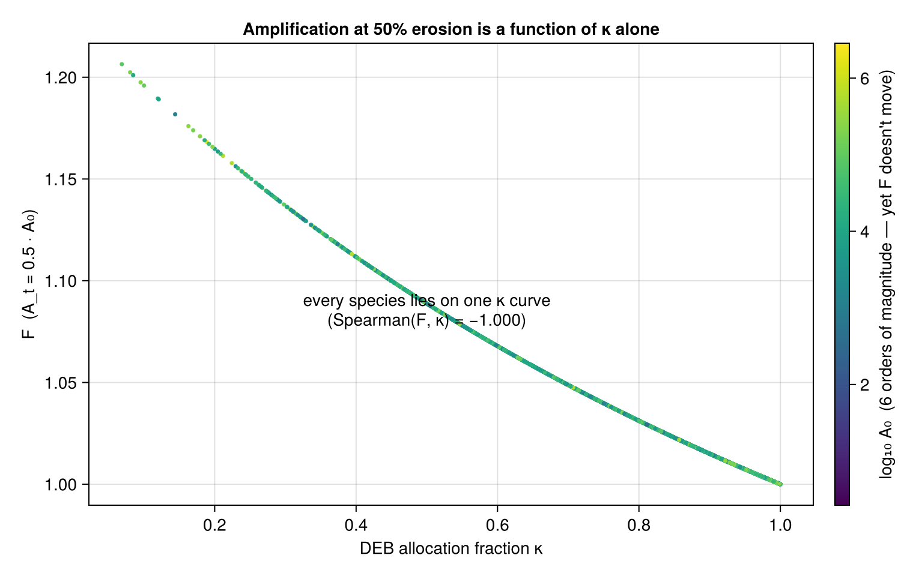

# Limitations & open questions

[← Getting started](Getting-Started.md) · [Home](Home.md)

This page is deliberately blunt. It protects the model's credibility by keeping
the weak points visible. Keep it current in the same PR as any change that affects
it. Evidence: [source audit (2026-06-11)](../claude/TwoTimescaleResilience_source_audit_2026-06-11.md)
and the read-only diagnostics in `examples/`.

## 1. The headline open question — amplification is functionally κ-only

**As currently parameterized, the amplification factor `F` is determined by the
DEB allocation fraction κ alone.** Across the whole AmP library (7,335 species),
`F` at any fixed erosion level matches a κ-only closed form to machine epsilon,
with Spearman(F, κ) = −1.000. The baseline margin `A0` spans six orders of
magnitude and contributes **nothing** to `F`; three of the four α-axes contribute
nothing either.

*Each point is a species. `F` at moderate erosion collapses onto a single curve in
κ — `A0` and the other axes do not move it.*

**Why:** two stacked causes in the offline mapping
([Equations §1](Equations.md#1-capacity-mapping-offline-amp--parameters)):

- `λ_max/λ_min = 1/κ` **exactly** (an artifact of how both bounds are normalized), and
- `KA = 0.3·A0`, so the species scale `A0` cancels out of the restoring-force curve.

A structural comparison (`examples/amp_lambda_structure_comparison.jl`) shows the
κ-lock lives in the **λ-bounds**, not in `KA`: making `KA` absolute barely changes
the ranking, because `Fmax ≤ λ_max/λ_min = 1/κ` for *any* `KA`. The real lever is
what sets the slow recovery floor `λ_min`.

**This is an open scientific decision, not a settled result.** The choices:

1. Keep `λ_min = p_M/A0` (relative margin) → own "vulnerability ≡ κ" as a finding,
   and check whether "low κ = more vulnerable" is ecologically correct or inverted.
2. Anchor `λ_min` to a size/rate quantity → vulnerability becomes size-driven (needs
   a principled, not crude, re-anchoring).
3. Re-derive the λ-bounds so their ratio is not identically `1/κ`.

This is the first question for DEB/AmP domain experts. Until it is resolved, treat
`F` rankings as **κ rankings**.

## 2. The `KA = 0.3·A0` constant is an undocumented knob

The `0.3` has **no derivation** anywhere in the manuscripts — the derivation
section justifies every other λ-parameter as AmP-anchored but lists `KA` as a bare
"half-saturation constant". It violates the project's own no-knob invariant and is
flagged for removal as part of resolving §1. It only sets the `1/(1+0.3)` factor;
changing the number rescales the amplification spread but does **not** break the
κ-collapse.

## 3. What was fixed (and what those fixes did *not* fix)

Two real defects in the **point-level** response API have been addressed:

- **Margin inertness (D1).** The default response mode is now the nondimensional
  `ec50_anchored_fractional_impairment` (`A_t = A0·(1−Q_t)`). The old
  `raw_margin_subtraction` (`A_t = A0 − Σ α·s`, inert because `A0 ≫ Σ α·s`) is
  retained as a diagnostic only.
- **Dead assimilation axis (D2).** The default weights are now κ-rule,
  assimilation-led. The previous normalized-α weights gave assimilation a weight
  of ~0.00004 for **every** species (an assimilation-targeting toxicant was
  ignored); it is now 0.5.

**Neither fix changes the κ-collapse** (§1) — that is structural in the λ-curve,
independent of the margin mapping and the weights.

**Still on the raw margin:** the **grid / ECOTOX / ISIMIP** pipelines have *not*
yet been moved to the nondimensional margin, so the spatial vulnerability *maps*
can still be inert. This is a known follow-up.

## 4. Scope boundaries (by design, not bugs)

- **Not full DEB/DEBtox.** Reserve/structure/maturity/κ-allocation dynamics are
  dropped; "mechanistic" overclaims, "physiologically structured" is honest.
- **`Z_t` (physiological condition memory)** is implemented but **opt-in and off by
  default** (`beta_Z=0`), and not yet validated/calibrated
  ([`condition_buffer.jl`](../../src/condition_buffer.jl)). Earlier docs that call
  it "not implemented" are stale.
- **`D_t` (DEBtox scaled damage)**, synergism, antagonism, fitted interactions:
  not implemented, intentionally.
- **Real-raster ingestion** is partial — basic NetCDF utilities exist
  ([`netcdf.jl`](../../src/netcdf.jl)) but robust general ingestion is mostly
  example scripts, not a stable API.

## 5. Proxies carrying weight on thin evidence

- `ρ`, `K` are class-level memory defaults, not measured kinetics.
- ECOTOX `effect_code` is a mode-of-action proxy for axis routing.
- These are honestly flagged but must stay loud in any published result. See
  [Data & parameters](Data-and-Parameters.md).

## 6. Diagnostics you can run

| Script | Question it answers |
| --- | --- |
| [`examples/amp_kappa_collapse_diagnostic.jl`](../../examples/amp_kappa_collapse_diagnostic.jl) | How κ-locked is `F`? (Answer: completely.) |
| [`examples/amp_lambda_structure_comparison.jl`](../../examples/amp_lambda_structure_comparison.jl) | Which structural lever breaks the κ-lock? (Answer: `λ_min`, not `KA`.) |
| [`examples/amp_species_response_capacity_diagnostics.jl`](../../examples/amp_species_response_capacity_diagnostics.jl) | Per-species response capacity from AmP. |

## 7. Deferred (hold until the core is stable)

Physiological condition memory `Z_t` (validation), DEBtox scaled damage `D_t`, and
robust real-raster ingestion stay deferred until the margin equation (§1), mixture
diagnostics, and clustering pipeline are stable.
