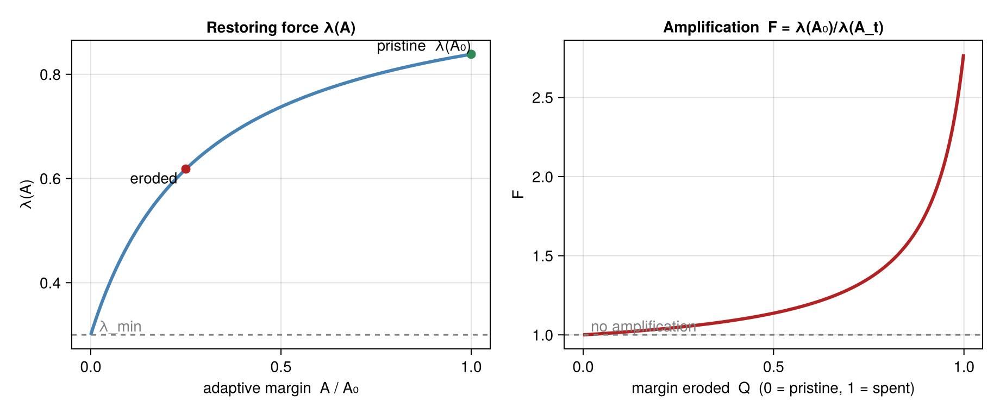

# How it works — the pipeline

[← Overview](Overview.md) · next: [Model equations →](Equations.md)

The framework is a chain of transformations from ambient concentrations to a
vulnerability field. Each stage is a small, testable component. The slow
(capacity/memory) and fast (response) halves meet at the adaptive margin.

```mermaid
flowchart LR
    %% Capacity
    AMP[AmP_Species_Library.json] --> AMPL[load_amp_species_library]
    AMPL --> CAP[DEBAxisParams: A0, alpha-axes, lambda-bounds, KA]

    %% Pressure + memory
    C["Concentration C_j,t"] --> BU[update_internal_burden!]
    MEM[Compound_Memory_Library.csv] --> BU
    BU --> B["Burden B_j,t"]
    ECO[ECOTOX_Toxicity_Library.json] --> STR[ecotox_active_stress]
    B --> STR
    STR --> X["Active stress x_j,t"]

    %% Routing + mixture
    X --> RT[ecotox_effect_to_deb_axis]
    RT --> CAB[Per-compound axis burdens]
    CAB --> MIX[aggregate_axis_mixture_effects]
    MIX --> E["E_axis (bounded impairments)"]

    %% Response (fast)
    E --> Q["Q_t = sum w_a E_a"]
    CAP --> Q
    Q --> A["A_t = A0 (1 - Q_t)"]
    A --> L["lambda(A_t)"]
    L --> F["F_t = lambda(A0)/lambda(A_t)"]

    %% Spatial
    F --> FEAT[build_threshold_free_vulnerability_features]
    FEAT --> STD[standardize_...]
    STD --> CL[cluster_..._regimes]
    CL --> OUT[write_vulnerability_regime_netcdf]
```

A richer node/edge inventory is in [docs/ARCHITECTURE_GRAPH.md](../ARCHITECTURE_GRAPH.md).

---

## Stage 1 — Capacity (AmP → `DEBAxisParams`)

Each species' response capacity is a set of numbers derived **offline** from its
AmP Dynamic Energy Budget parameters `{p_Am, p_M, κ, v}`:

- `A0` — baseline adaptive margin (maximum reserve density `E_m = p_Am / v`).
- `alpha_axes` — per-axis sensitivities `(α_A, α_M, α_G, α_R)`.
- `lambda_min`, `lambda_max` — slow/fast recovery-rate bounds.
- `KA` — half-saturation of the restoring-force curve.

These are precomputed by **`src/AmP_Translator.jl`** (a standalone script — *not*
part of the module) and stored in `data/AmP_Species_Library.json`. At runtime,
[`amp_library.jl`](../../src/amp_library.jl) only loads and validates them. To
change the mapping you edit `AmP_Translator.jl` and regenerate the JSON. See
[Data & parameters](Data-and-Parameters.md).

## Stage 2 — Memory (`C → B`)

Ambient concentration `C_{j,t}` is carried forward as internal burden `B_{j,t}`
through a retention recurrence with compound-specific retention `ρ` and
bioaccumulation `K`:

$$ B_t = \rho\,B_{t-1} + (1-\rho)\,K\,C_t $$

Stateful updates live in [`ecotox_library.jl`](../../src/ecotox_library.jl)
(`EcotoxExposureState`, `update_internal_burden!`); analytical spin-up helpers
are in [`compound_memory_warmup.jl`](../../src/compound_memory_warmup.jl). Full
detail: [Compound memory](../compound_memory.md).

## Stage 3 — Pressure (`B → x`)

Burden (or raw concentration) is converted to **active stress** `x` by anchoring
to ECOTOX no-effect and effect levels:

$$ x = \max\!\left(0,\ \frac{B - \text{NOEC}}{\text{EC50} - \text{NOEC}}\right) $$

`ecotox_active_stress` does this; records are loaded and filtered by
[`ecotox_library.jl`](../../src/ecotox_library.jl).

## Stage 4 — Routing & mixture aggregation (`x → E_axis`)

Each compound's stress is routed to one of the four DEB axes by its ECOTOX
**effect code** (a mode-of-action proxy), then per-axis contributions from
multiple compounds are combined into bounded impairments `E_axis ∈ [0,1]` using
an explicit mixture-effect assumption:

- **TU** — toxic-unit sum (concentration addition within a shared target),
- **IA** — independent action (distinct targets),
- **grouped CA-then-IA** — the preferred default: CA within an effect-code group,
  IA across groups.

See [`mixture_aggregation.jl`](../../src/mixture_aggregation.jl) and
[Mixture-effect models](../mixture_effect_models.md).

## Stage 5 — Response (`E_axis → Q → A → λ → F`)

This is the fast half, in [`deb_axes.jl`](../../src/deb_axes.jl). Steps 1–2 produce
**the product — the adaptive-margin state**; steps 3–4 are the **derived `F`
readout** (see [Overview](Overview.md)):

1. **Aggregate to a scalar load.** $Q_t = \sum_a w_a E_a$, with dimensionless
   κ-rule weights $w = [\tfrac12,\ \tfrac{\kappa}{4},\ \tfrac{\kappa}{4},\ \tfrac{1-\kappa}{2}]$.
   *(The per-axis vector `E_a` — which processes are hit — is itself a primary
   output, not just its sum.)*
2. **Narrow the margin.** $A_t = A_0\,(1 - Q_t)$ (the canonical, nondimensional
   mode — see note below). **This margin state — relative depletion `Q_t`, the
   absolute margin `A_t` (carrying capacity `A_0`), and the axis composition — is
   the vulnerability signal.**
3. *(derived)* **Reduce the restoring force.** $\lambda(A_t) = \lambda_{\min} + (\lambda_{\max}-\lambda_{\min})\dfrac{A_t}{K_A + A_t}$.
4. *(derived)* **Amplify.** $F_t = \lambda(A_0)/\lambda(A_t)$ — a convenient scalar,
   but capacity-blind and one-dimensional ([Limitations](Limitations-and-Open-Questions.md)).

*Restoring force `λ(A)` (left): as chronic pressure erodes the margin from `A0`
toward 0, the restoring force falls from `λ(A0)` toward `λ_min`. Amplification
`F` (right): the resulting burden multiplier grows as the margin is spent.*

> **Response modes.** `compute_adaptive_margin_response` defaults to the
> **nondimensional** `ec50_anchored_fractional_impairment` mode shown above. A
> legacy `raw_margin_subtraction` mode (`A_t = A0 − Σ α·s`) is retained as a
> **diagnostic only** — it is numerically inert because `A0 ≫ Σ α·s`. See
> [Limitations](Limitations-and-Open-Questions.md).

The math for every stage is collected in [Model equations](Equations.md).

## Stage 6 — Spatial vulnerability regimes (optional)

Given grids of response metrics (`Q_t`, `A_t`, `E_a`, `F_t`), the spatial layer
builds continuous **threshold-free** features, standardises them, clusters them
into **vulnerability regimes**, and writes maps/NetCDF/CSV. Consistent with the
margin-first framing, the feature set leads with the **margin state**: relative
margin remaining, the **capacity-aware absolute-margin** features
(`*_log_absolute_margin_*`, `*_baseline_capacity` — which keep the `A_0` scale the
`F`-ratio discards), and the **axis-composition** fingerprint (`mean_E_*`,
`axis_entropy`, `dominant_axis_code`). `F`-derived features are retained but are a
secondary, derived summary. Use **`standardize_for_clustering`** (not the bare
standardiser) for the clustering step: it drops the ~70% redundant features while
preserving the margin-state dimensions, so regimes are driven by load, capacity, and
axis composition rather than duplicate `F` summaries
([why](Limitations-and-Open-Questions.md), [M1 note](../notes/feature_redundancy_check.md)).

- [`vulnerability_feature_vectors.jl`](../../src/vulnerability_feature_vectors.jl) → [Feature vectors](../vulnerability_feature_vectors.md)
- [`vulnerability_regime_clustering.jl`](../../src/vulnerability_regime_clustering.jl)
- [`vulnerability_regime_outputs.jl`](../../src/vulnerability_regime_outputs.jl) → [Regime outputs](../vulnerability_regime_outputs.md)
- [Tranche comparison](../vulnerability_tranche_comparison.md) for decadal change.

Cluster labels are **relative regime descriptions**, never safe/unsafe classes.
The feature layer rejects exceedance-style naming (`_gt_`, `threshold`, …) by
construction.
